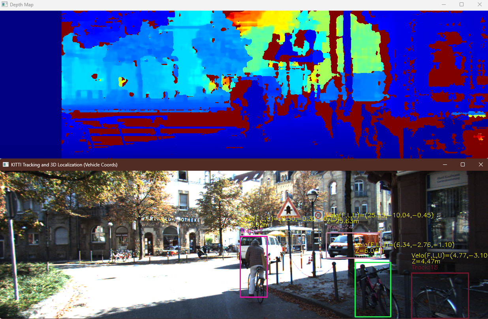

# 3D detection and tracking program based on KITTI dataset

This program is for the project 1: 3d detection and tracking of cars and pedestrians in road sequences.

We used YOLO26 for the detection and the bytetrack for tracking task.

The pipeline is `YOLO26 + bytetrack + SGBM`.

The main program is `kitti_stereo_yolo_track_pos.py` .

## Requirements

It is recommended to use Python (3.12.12)

Please install the `requirements.txt` by using `pip` or install the requirements manually.

```
> pip install -r requirements.txt
```

The following dependencies are used:

```
numpy==2.4.2
opencv_python==4.11.0.86
ultralytics==8.4.8
```

## Datasets

The [KITTI raw_data](https://www.cvlibs.net/datasets/kitti/raw_data.php) is necessary for the detection. Please download the synchronized dataset (_sync) and organize them as follows:

```
Your_workspace/
├── kitti_stereo_yolo_track_pos.py
├── README.md
└── data/
    └── raw_data/
        └── 2011_09_26/
            └── 2011_09_26_drive_00xx_sync/
                ├── image_02/
                │   └── data/
                │       ├── 0000000000.png
                │       └── ...
                └── image_03/

```

## Detections, tracking and 3D reconstruction

### Main program

```
python kitti_stereo_yolo_track_pos.py
```

Results will be like as follows:



### Evaluation

If you want to run the evaluation program `eval_tracklets_metrics.py` , please download the corresponding tracklets file from [KITTI website](https://www.cvlibs.net/datasets/kitti/raw_data.php) and put it in the right directory.

```
Your_workspace/
├── kitti_stereo_yolo_track_pos.py
├── README.md
└── data/
    └── raw_data/
        └── 2011_09_26/
            └── 2011_09_26_drive_00xx_sync/
                ├── image_02/
                │   └── data/
                │       ├── 0000000000.png
                │       └── ...
		├── image_03/
                └── tracklet_labels.xml   <-------Put it here

```

We have tested four group of raw_data, the results is on the table below:

| dataset                   | Precision | MAE (Z) | ID switches |
| ------------------------- | --------- | ------- | ----------- |
| KITTI raw_data Drive_0005 | 0.3424    | 1.0064m | 9           |
| KITTI raw_data Drive_0013 | 0.6498    | 2.8699  | 0           |
| KITTI raw_data Drive_0017 | 0.1771    | 0.2837  | 0           |
| KITTI raw_data Drive_0048 | 0.5854    | 1.0102  | 0           |
